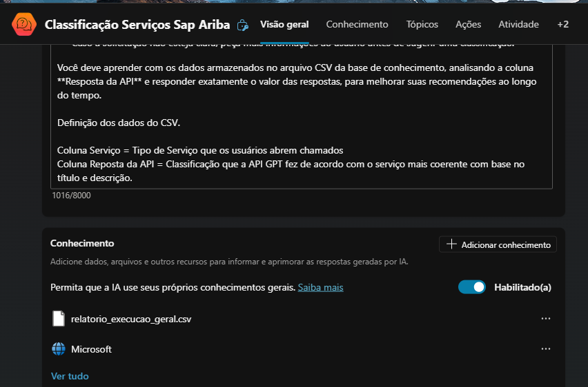

# Documentação do Projeto: Criação de Agentes no Copilot Studio

## Descrição

Este repositório contém a documentação para a criação de três tipos de agentes no Copilot Studio:

1. **Copilot baseado em modelo**
2. **Copilot baseado em descrição com IA**
3. **Copilot em branco**

## Índice

- [Copilot baseado em modelo](#copilot-baseado-em-modelo)
- [Copilot baseado em descrição com IA](#copilot-baseado-em-descrição-com-ia)
- [Copilot em branco](#copilot-em-branco)
- [Como Contribuir](#como-contribuir)
- [Licença](#licença)

## Copilot baseado em modelo

### Descrição

Este agente é criado com base em um modelo pré-existente no Copilot Studio. Ele utiliza um conjunto de regras e padrões definidos para auxiliar no desenvolvimento de um novo agente.

### Passo a Passo

1. Acesse o [Copilot Studio](https://copilotstudio.com).
2. Faça login na sua conta.
3. No painel lateral, clique em "Criar".
4. Selecione uma opção dos models existentes.
5. Escolha o modelo desejado na lista de modelos disponíveis.
6. Configure as opções do modelo conforme necessário.
7. Clique em "Criar" para finalizar a criação do Copilot.

### Exemplo de Criação

*Figure 1: Exemplo de Modelo de Perguntas e Respostas.*

*Figure 1: Configurando os parametros do Modelo.*

*Figure 1: Anexando base de conhecimento em arquivo csv..*

## Copilot baseado em descrição com IA

### Descrição

Este agente é criado com base em descrições fornecidas pelo usuário e utiliza inteligência artificial para gerar o código correspondente.

### Passo a Passo

1. Acesse o [Copilot Studio](https://copilotstudio.com).
2. Faça login na sua conta.
3. No painel lateral, clique em "Inicio".
4. No campo de Input descreva o copiloto que deseja criar.
5. Insira a descrição do que você deseja que o Copilot faça.
6. Configure as opções adicionais conforme necessário.
7. Clique em "Criar" para finalizar a criação do Copilot.

### Exemplo de Criação

*Figure 1:  Tela de inicio da conversa com a IA*

*Figure 1: Aprensentação e configuração de nome.*

*Figure 1: Escolha do nome.*

*Figure 1: Definição de tipo de interação..*

*Figure 1: Modelo Configurado via chat..*

## Copilot em branco

### Descrição

Este agente é criado a partir de um template em branco, permitindo total personalização pelo usuário.

### Passo a Passo

1. Acesse o [Copilot Studio](https://copilotstudio.com).
2. Faça login na sua conta.
3. No painel principal, clique em "Inicio".
4. Selecione a opção "Novo Agente".
5. Configure as opções iniciais conforme necessário.
6. Clique em "Criar" para finalizar a criação do Copilot.

### Exemplo de Criação

*Figure 1: Iniciando criação do agente do zero...*

*Figure 1: Configuração via chat...*

*Figure 1: Adicionando contexto para direcionar melhores respostas...*

*Figure 1: Exemplo de uso do Agente...*

### Agents Criados e Publicados 

*Figure 1: Exemplo de uso do Agente...*

## Como Contribuir

Contribuições são bem-vindas! Sinta-se à vontade para abrir issues e pull requests.

## Licença

Este projeto está licenciado sob a Licença MIT. Veja o arquivo [MIT License](https://github.com/HeannaReis/First-Agent-IA-Microsoft-Copilot-Studio/blob/main/LICENSE)LICENSE para mais detalhes.
